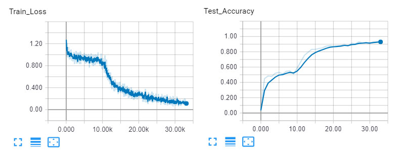
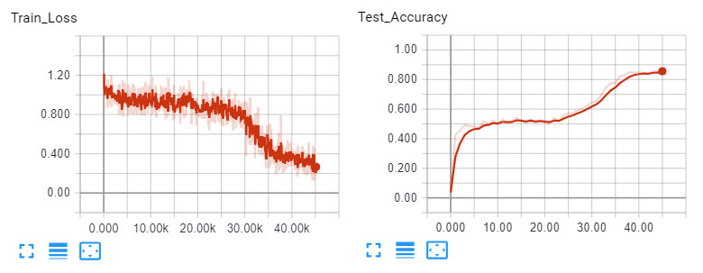
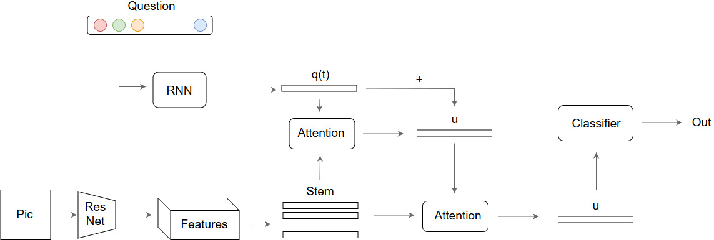
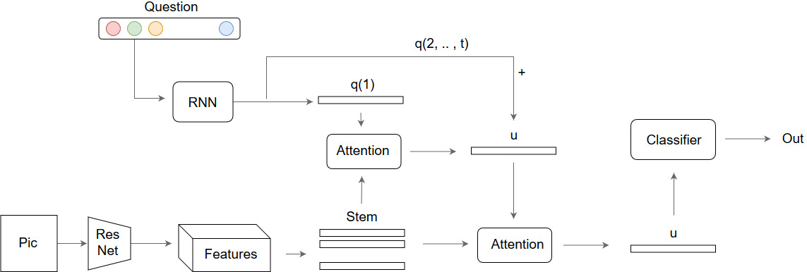
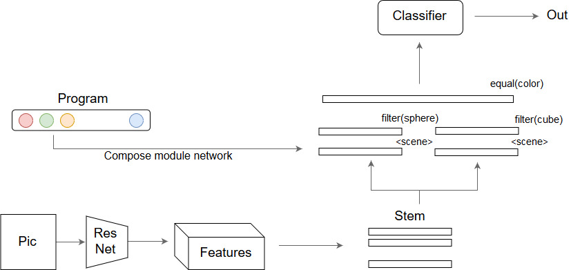
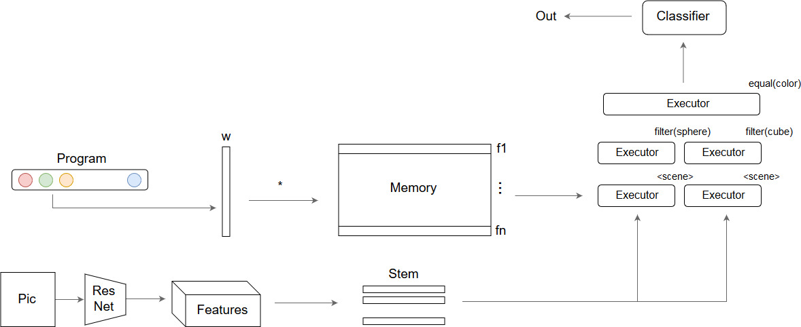
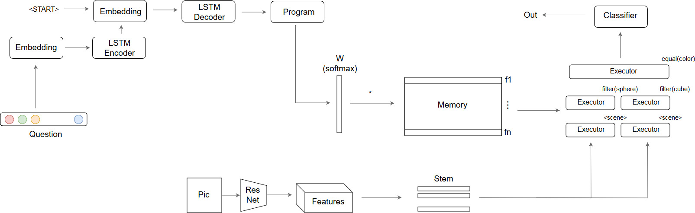

# VisualReasoning_MMnet
Models in Pytorch for visual reasoning task on Clevr dataset.   
**Stack attention**: 
https://arxiv.org/pdf/1511.02274.pdf  
**Module network**: 
https://arxiv.org/pdf/1705.03633.pdf  
Yes, but what's new?  
Try to archive same performance in end-to-end differentiable architecture:  
**Module memory network** [new] 
**Module memory network end2end differentiable** [new]   
Try to archive weak supervision:  
(**Work in progress**)  

## Test sample

## Train
Module memory network (Pg_memory) 
  
Module memory network end2end (Pg_endtoend) 
 

## Models 

### Stack Attention (SAN)

### Stack Attention word2word (SAN_wbw)

### Module Network (PG)

### Module-Memory Network (PG_memory)

### Module-Memory Network end2end (PG_endtoend)

